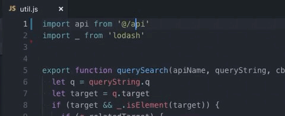

# vs-alias-jump

> VS Code Extension: jump to alias file



This project forked from [this project](https://github.com/wanfu920/jumpToAliasFile).

It looks similar, but it's different.

## What's diffrent?

- Support relative path.
- Not support webpack config.

## Install

- You can install it from the marketplace.
- or `Ctrl+Shift+P` + `ext install vs-alias-jump`

## Options

- `vs-alias-jump.alias` : Defines alias for jump to file

```
// auto replace `${folder}` to your workspace path
"vs-alias-jump.alias": {
  "@src": "${folder}/src", // relative path
  "$home": "/Users/blahblah/..." // absolute path
}
```

## Tip

> It's good to use together.

- [Path Autocomplete](https://marketplace.visualstudio.com/items?itemName=ionutvmi.path-autocomplete) : provides path completion for VS Code (alias, etc...)

## Todo

- [ ] auto generated from specific config (webpack? custom?)
- [ ] refactoring

## License

[MIT](LICENSE)
